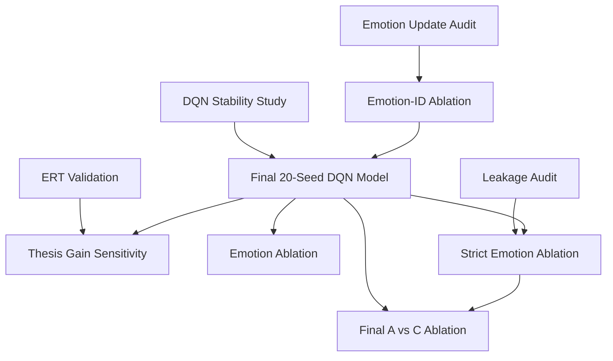

# Final Thesis Artifact Inventory

**Project:** AI-Driven Emotion Recognition for Adaptive Learning � RL Module  
**Scope:** Non-archived outputs under `RL_Module/figures/` plus driver scripts that produce them  
**Thesis tutors:** DQN � Random � Expert Rule Tutor (ERT)  
**Excluded from thesis:** PPO and all `figures/_archive/` content  
**Generated:** 2026-05-31

---

## Chapter map (inferred)

No dissertation `.tex`/`.docx` is versioned in this repository. Chapter assignments below follow the study pipeline and standard thesis structure. Update the **Chapter cited** column when you insert `\ref{}` / `\includegraphics{}` in the final document.

| Chapter | Topic | Studies |
|---------|-------|---------|
| **Ch. 3 � Methodology** | MDP, baselines, affect dynamics | ERT Validation, Emotion Update Audit |
| **Ch. 4 � Experimental design & model selection** | DQN config, checkpoints, frozen model | DQN Stability Study, Emotion-ID Ablation, Final 20-Seed DQN Model |
| **Ch. 5 � Main results** | Tutor comparison at G4 and gain sensitivity | Thesis Gain Sensitivity |
| **Ch. 6 � Ablation studies** | Observation vs strict vs capstone | Emotion Ablation, Strict Emotion Ablation, Final A vs C Ablation |
| **Appendix** | Leakage audit, per-run data, machine-readable exports | Strict Leakage Audit, CSV/JSON reproducibility bundle |

---

## Summary

| Category | Count | KEEP (main) | KEEP (appendix) | DELETE (thesis bundle) |
|----------|------:|------------:|----------------:|-----------------------:|
| PNG plots | 14 | 14 | 0 | 0 |
| Markdown reports | 9 | 9 | 0 | 0 |
| JSON reports | 10 | 0 | 10 | 0 |
| CSV tables | 51 | 22 | 26 | 3 |
| Run logs | 5 | 0 | 0 | 5 |
| **Total artifacts** | **89** | **45** | **36** | **8** |

**DELETE** means: do not attach to the dissertation submission bundle; file remains in the repo for audit/reproducibility.

---

## Driver scripts (reproducibility � not submission artifacts)

| Script | Study | KEEP |
|--------|-------|------|
| `thesis_gain_sensitivity.py` | Main tutor comparison | KEEP (repo) |
| `ert_action_validation.py` | ERT baseline validation | KEEP (repo) |
| `emotion_update_audit` (inline in strict study) | Affect dynamics audit | KEEP (repo) |
| `dqn_stability_study.py` | DQN stability | KEEP (repo) |
| `emotion_id_ablation_study.py` | Emotion-ID ablation | KEEP (repo) |
| `final_dqn_model_study.py` | Final 20-seed model | KEEP (repo) |
| `emotion_ablation.py` | Observation ablation | KEEP (repo) |
| `strict_emotion_ablation.py` | Strict MDP ablation | KEEP (repo) |
| `final_ac_ablation.py` | Capstone A vs C ablation | KEEP (repo) |

---

## 1. Thesis Gain Sensitivity

**Study:** Random vs ERT vs DQN across gain ratios G0�G5 (canonical main comparison).  
**Primary chapter:** Ch. 5 � Main results

| File | Type | Chapter cited | Recommendation |
|------|------|---------------|----------------|
| `figures/thesis_gain_sensitivity/THESIS_GAIN_SENSITIVITY_REPORT.md` | Report | Ch. 5 | **KEEP (main)** � primary results narrative |
| `figures/thesis_gain_sensitivity/thesis_gain_overview.png` | Plot | Ch. 5 | **KEEP (main)** � Figure: tutor comparison + sensitivity |
| `figures/thesis_gain_sensitivity/ranking_table_g4.csv` | CSV | Ch. 5 | **KEEP (main)** � Table: G4 ranking (DQN / ERT / Random) |
| `figures/thesis_gain_sensitivity/sensitivity_table.csv` | CSV | Ch. 5 | **KEEP (main)** � Table: learning gain by gain ratio |
| `figures/thesis_gain_sensitivity/comparison_table_all_ratios.csv` | CSV | Ch. 5 | **KEEP (main)** � Table: multi-metric sensitivity |
| `figures/thesis_gain_sensitivity/pairwise_tests_g4.csv` | CSV | Ch. 5 | **KEEP (main)** � Table: Holm-corrected pairwise tests at G4 |
| `figures/thesis_gain_sensitivity/pairwise_tests_all_gains.csv` | CSV | Ch. 5 | **KEEP (appendix)** � Full pairwise export |
| `figures/thesis_gain_sensitivity/sensitivity_multi_metric.csv` | CSV | Ch. 5 | **KEEP (appendix)** � Extended metric sensitivity |
| `figures/thesis_gain_sensitivity/thesis_gain_per_run.csv` | CSV | Appendix | **KEEP (appendix)** � Per-run reproducibility |
| `figures/thesis_gain_sensitivity/thesis_gain_sensitivity_report.json` | JSON | Appendix | **KEEP (appendix)** � Machine-readable full report |
| `figures/thesis_gain_sensitivity/thesis_run.log` | Log | � | **DELETE** � training console log; not cited |

---

## 2. ERT Validation

**Study:** Expert Rule Tutor action-frequency and behavioural validation.  
**Primary chapter:** Ch. 3 � Methodology (baseline definition)

| File | Type | Chapter cited | Recommendation |
|------|------|---------------|----------------|
| `figures/ert_validation/ert_action_distribution.png` | Plot | Ch. 3 | **KEEP (main)** � Figure: ERT action distribution |
| `figures/ert_validation/action_frequency_summary.csv` | CSV | Ch. 3 | **KEEP (main)** � Table: aggregate ERT action frequencies |
| `figures/ert_validation/action_frequency_per_seed.csv` | CSV | Appendix | **KEEP (appendix)** � Per-seed ERT frequencies |
| `figures/ert_validation/ert_validation_report.json` | JSON | Appendix | **KEEP (appendix)** � Machine-readable validation report |

---

## 3. Emotion Update Audit

**Study:** Read-only audit of AR(1) affect update equations in `student_model.py`.  
**Primary chapter:** Ch. 3 � Methodology (simulator validity)

| File | Type | Chapter cited | Recommendation |
|------|------|---------------|----------------|
| `figures/emotion_update_audit/EMOTION_UPDATE_AUDIT.md` | Report | Ch. 3 | **KEEP (main)** � cited by Emotion-ID ablation methodology |
| `figures/emotion_update_audit/emotion_update_audit_report.json` | JSON | Appendix | **KEEP (appendix)** � Monte Carlo simulation outputs |

---

## 4. DQN Stability Study

**Study:** Training length, checkpoint selection, exploration, target-update, and architecture stability.  
**Primary chapter:** Ch. 4 � Experimental design

| File | Type | Chapter cited | Recommendation |
|------|------|---------------|----------------|
| `figures/dqn_stability_study/DQN_STABILITY_REPORT.md` | Report | Ch. 4 | **KEEP (main)** � justifies 50k + checkpoint selection |
| `figures/dqn_stability_study/training_length_stability.png` | Plot | Ch. 4 | **KEEP (main)** � Figure: training-length vs learning gain |
| `figures/dqn_stability_study/hyperparam_stability_ranking.png` | Plot | Ch. 4 | **KEEP (main)** � Figure: hyperparameter variance ranking |
| `figures/dqn_stability_study/training_length_summary.csv` | CSV | Ch. 4 | **KEEP (main)** � Table: training-length aggregates |
| `figures/dqn_stability_study/hyperparam_summary.csv` | CSV | Ch. 4 | **KEEP (main)** � Table: hyperparameter screen summary |
| `figures/dqn_stability_study/training_length_per_run.csv` | CSV | Appendix | **KEEP (appendix)** � Per-run training-length data |
| `figures/dqn_stability_study/hyperparam_screen_per_run.csv` | CSV | Appendix | **KEEP (appendix)** � Per-run hyperparameter screen |
| `figures/dqn_stability_study/checkpoint_selection_per_run.csv` | CSV | Appendix | **KEEP (appendix)** � Checkpoint selection detail |
| `figures/dqn_stability_study/dqn_stability_report.json` | JSON | Appendix | **KEEP (appendix)** � Machine-readable stability report |

---

## 5. Emotion-ID Ablation

**Study:** A (with `emotion_id`) vs D (without `emotion_id`); selects frozen thesis observation vector.  
**Primary chapter:** Ch. 4 � Model selection

| File | Type | Chapter cited | Recommendation |
|------|------|---------------|----------------|
| `figures/emotion_id_ablation/EMOTION_ID_ABLATION_REPORT.md` | Report | Ch. 4 | **KEEP (main)** � documents removal of `emotion_id` |
| `figures/emotion_id_ablation/emotion_id_ablation_overview.png` | Plot | Ch. 4 | **KEEP (main)** � Figure: A vs D comparison |
| `figures/emotion_id_ablation/volatility_vs_learning_gain.png` | Plot | Ch. 4 | **KEEP (main)** � Figure: seed volatility analysis |
| `figures/emotion_id_ablation/summary_best_checkpoint.csv` | CSV | Ch. 4 | **KEEP (main)** � Table: best-checkpoint aggregates |
| `figures/emotion_id_ablation/summary_final_checkpoint.csv` | CSV | Ch. 4 | **KEEP (appendix)** � Final-50k checkpoint comparison |
| `figures/emotion_id_ablation/pairwise_best_checkpoint.csv` | CSV | Ch. 4 | **KEEP (main)** � Table: A vs D pairwise (best checkpoint) |
| `figures/emotion_id_ablation/pairwise_final_checkpoint.csv` | CSV | Appendix | **KEEP (appendix)** � Final-checkpoint pairwise |
| `figures/emotion_id_ablation/seed_robustness_10_vs_15.csv` | CSV | Ch. 4 | **KEEP (main)** � Table: seed-set robustness |
| `figures/emotion_id_ablation/volatility_correlations.csv` | CSV | Appendix | **KEEP (appendix)** � Volatility correlation detail |
| `figures/emotion_id_ablation/volatility_per_seed.csv` | CSV | Appendix | **KEEP (appendix)** � Per-seed volatility |
| `figures/emotion_id_ablation/emotion_id_ablation_per_run.csv` | CSV | Appendix | **KEEP (appendix)** � Per-run raw results |
| `figures/emotion_id_ablation/checkpoint_eval_per_run.csv` | CSV | Appendix | **KEEP (appendix)** � Checkpoint evaluation detail |
| `figures/emotion_id_ablation/emotion_id_ablation_report.json` | JSON | Appendix | **KEEP (appendix)** � Machine-readable report |
| `figures/emotion_id_ablation/full_run.log` | Log | � | **DELETE** � training console log; not cited |

**Cross-study dependency:** Seeds 1�15 of the final baseline model are sourced from this study (`FINAL_DQN_MODEL_REPORT.md` �Reference Studies).

---

## 6. Final 20-Seed DQN Model

**Study:** Matched 20-seed confirmation of frozen `baseline_thesis` DQN (Tier A rejected).  
**Primary chapter:** Ch. 4 � Final frozen model

| File | Type | Chapter cited | Recommendation |
|------|------|---------------|----------------|
| `figures/final_dqn_model/FINAL_DQN_MODEL_REPORT.md` | Report | Ch. 4 | **KEEP (main)** � final model selection decision |
| `figures/final_dqn_model/final_dqn_model_overview.png` | Plot | Ch. 4 | **KEEP (main)** � Figure: Tier A vs baseline (20 seeds) |
| `figures/final_dqn_model/metrics_table_matched_20.csv` | CSV | Ch. 4 | **KEEP (main)** � Table: matched 20-seed aggregates |
| `figures/final_dqn_model/pairwise_tier_vs_baseline_20seed.csv` | CSV | Ch. 4 | **KEEP (main)** � Table: Tier A vs baseline pairwise (n=20) |
| `figures/final_dqn_model/summary_baseline_best_20.csv` | CSV | Ch. 4 | **KEEP (main)** � Table: frozen baseline summary |
| `figures/final_dqn_model/summary_tier_a_best_20.csv` | CSV | Ch. 4 | **KEEP (appendix)** � Tier A summary (rejected config) |
| `figures/final_dqn_model/checkpoint_selection_per_seed.csv` | CSV | Ch. 4 | **KEEP (appendix)** � Tier A checkpoint picks |
| `figures/final_dqn_model/baseline_checkpoint_selection_per_seed.csv` | CSV | Ch. 4 | **KEEP (appendix)** � Baseline checkpoint picks |
| `figures/final_dqn_model/final_dqn_per_run.csv` | CSV | Appendix | **KEEP (appendix)** � Tier A per-run data |
| `figures/final_dqn_model/baseline_per_run_20.csv` | CSV | Appendix | **KEEP (appendix)** � Baseline seeds 16�20 + full 20-seed set |
| `figures/final_dqn_model/checkpoint_eval_per_run.csv` | CSV | Appendix | **KEEP (appendix)** � Tier A checkpoint eval |
| `figures/final_dqn_model/baseline_checkpoint_eval_per_run.csv` | CSV | Appendix | **KEEP (appendix)** � Baseline checkpoint eval |
| `figures/final_dqn_model/final_dqn_model_report.json` | JSON | Appendix | **KEEP (appendix)** � Machine-readable report |
| `figures/final_dqn_model/pairwise_tier_vs_baseline.csv` | CSV | � | **DELETE** � ambiguous label; superseded by `_20seed` |
| `figures/final_dqn_model/pairwise_tier_vs_baseline_15seed.csv` | CSV | � | **DELETE** � superseded by 20-seed matched protocol |
| `figures/final_dqn_model/summary_baseline_best_15.csv` | CSV | � | **DELETE** � superseded by `summary_baseline_best_20.csv` |
| `figures/final_dqn_model/full_run.log` | Log | � | **DELETE** � Tier A training log |
| `figures/final_dqn_model/baseline_20seed_run.log` | Log | � | **DELETE** � baseline training log |

**Frozen model specification (for all subsequent studies):**

- Observation: `knowledge, engagement, frustration, confusion, boredom` (no `emotion_id`)
- Hyperparameters: `lr=0.001, batch=64, buffer=100k, net=[64,64], expl_frac=0.3, final_eps=0.05, target_update=500`
- Training: 50k steps, best checkpoint from {10k�50k}
- Gain ratio: G4 (10:1)

---

## 7. Emotion Ablation (Observation-Only)

**Study:** Full-emotion vs knowledge-only **observations** for Random, ERT, and DQN.  
**Primary chapter:** Ch. 6 � Ablation (agent-side information)

| File | Type | Chapter cited | Recommendation |
|------|------|---------------|----------------|
| `figures/emotion_ablation/EMOTION_ABLATION_REPORT.md` | Report | Ch. 6 | **KEEP (main)** � observation ablation narrative |
| `figures/emotion_ablation/emotion_ablation_overview.png` | Plot | Ch. 6 | **KEEP (main)** � Figure: condition � tutor overview |
| `figures/emotion_ablation/emotion_ablation_table.png` | Plot | Ch. 6 | **KEEP (main)** � Figure: summary table graphic |
| `figures/emotion_ablation/emotion_benefit_heatmap.png` | Plot | Ch. 6 | **KEEP (main)** � Figure: emotion-channel benefit heatmap |
| `figures/emotion_ablation/emotion_ablation_summary.csv` | CSV | Ch. 6 | **KEEP (main)** � Table: aggregate by condition � tutor |
| `figures/emotion_ablation/pairwise_full_vs_knowledge_only.csv` | CSV | Ch. 6 | **KEEP (main)** � Table: A vs B pairwise tests |
| `figures/emotion_ablation/emotion_ablation_per_run.csv` | CSV | Appendix | **KEEP (appendix)** � Per-run raw results |
| `figures/emotion_ablation/emotion_ablation_report.json` | JSON | Appendix | **KEEP (appendix)** � Machine-readable report |

---

## 8. Strict Emotion Ablation

**Study:** Three-way factorial A/B/C isolating observations vs dynamics vs strict no-emotion MDP.  
**Primary chapter:** Ch. 6 � Ablation (MDP decomposition)

| File | Type | Chapter cited | Recommendation |
|------|------|---------------|----------------|
| `figures/strict_emotion_ablation/STRICT_EMOTION_ABLATION_REPORT.md` | Report | Ch. 6 | **KEEP (main)** � factorial decomposition results |
| `figures/strict_emotion_ablation/EMOTION_LEAKAGE_AUDIT.md` | Report | Ch. 6 / Appendix | **KEEP (main)** � strict-mode leakage checklist; cited by Final A vs C |
| `figures/strict_emotion_ablation/strict_ablation_overview.png` | Plot | Ch. 6 | **KEEP (main)** � Figure: A/B/C overview |
| `figures/strict_emotion_ablation/emotion_decomposition.png` | Plot | Ch. 6 | **KEEP (main)** � Figure: obs vs dynamics decomposition |
| `figures/strict_emotion_ablation/strict_ablation_summary.csv` | CSV | Ch. 6 | **KEEP (main)** � Table: condition aggregates |
| `figures/strict_emotion_ablation/strict_ablation_pairwise.csv` | CSV | Ch. 6 | **KEEP (main)** � Table: A�B, B�C, A�C pairwise |
| `figures/strict_emotion_ablation/strict_ablation_per_run.csv` | CSV | Appendix | **KEEP (appendix)** � Per-run raw results |
| `figures/strict_emotion_ablation/strict_ablation_report.json` | JSON | Appendix | **KEEP (appendix)** � Machine-readable report |
| `figures/strict_emotion_ablation/emotion_leakage_audit.json` | JSON | Appendix | **KEEP (appendix)** � Runtime test results for leakage checklist |

---

## 9. Final A vs C Ablation (Capstone)

**Study:** 20-seed emotion-aware DQN (Condition A) vs strict knowledge-only DQN (Condition C).  
**Primary chapter:** Ch. 6 � Ablation (capstone)

| File | Type | Chapter cited | Recommendation |
|------|------|---------------|----------------|
| `figures/final_ac_ablation/FINAL_AC_ABLATION_REPORT.md` | Report | Ch. 6 | **KEEP (main)** � capstone ablation conclusion |
| `figures/final_ac_ablation/final_ac_ablation_overview.png` | Plot | Ch. 6 | **KEEP (main)** � Figure: A vs C overview |
| `figures/final_ac_ablation/final_ac_per_seed_learning_gain.png` | Plot | Ch. 6 | **KEEP (main)** � Figure: per-seed learning gain |
| `figures/final_ac_ablation/metrics_table.csv` | CSV | Ch. 6 | **KEEP (main)** � Table: aggregate metrics (n=20) |
| `figures/final_ac_ablation/pairwise_a_vs_c.csv` | CSV | Ch. 6 | **KEEP (main)** � Table: Holm-corrected A vs C tests |
| `figures/final_ac_ablation/summary_condition_a.csv` | CSV | Ch. 6 | **KEEP (main)** � Table: Condition A summary |
| `figures/final_ac_ablation/summary_condition_c.csv` | CSV | Ch. 6 | **KEEP (main)** � Table: Condition C summary |
| `figures/final_ac_ablation/checkpoint_selection_a.csv` | CSV | Appendix | **KEEP (appendix)** � Condition A checkpoint picks |
| `figures/final_ac_ablation/checkpoint_selection_c.csv` | CSV | Appendix | **KEEP (appendix)** � Condition C checkpoint picks |
| `figures/final_ac_ablation/condition_a_per_run.csv` | CSV | Appendix | **KEEP (appendix)** � Condition A per-run data |
| `figures/final_ac_ablation/condition_c_per_run.csv` | CSV | Appendix | **KEEP (appendix)** � Condition C per-run data |
| `figures/final_ac_ablation/condition_c_checkpoint_eval.csv` | CSV | Appendix | **KEEP (appendix)** � Condition C checkpoint eval |
| `figures/final_ac_ablation/final_ac_ablation_report.json` | JSON | Appendix | **KEEP (appendix)** � Machine-readable report |
| `figures/final_ac_ablation/full_run.log` | Log | � | **DELETE** � training console log; not cited |

---

## Recommended dissertation figure set (minimum)

These 14 plots are the primary visual assets for the final dissertation body:

| # | File | Study |
|---|------|-------|
| 1 | `thesis_gain_sensitivity/thesis_gain_overview.png` | Main comparison |
| 2 | `ert_validation/ert_action_distribution.png` | ERT baseline |
| 3 | `dqn_stability_study/training_length_stability.png` | DQN config |
| 4 | `dqn_stability_study/hyperparam_stability_ranking.png` | DQN config |
| 5 | `emotion_id_ablation/emotion_id_ablation_overview.png` | Model selection |
| 6 | `emotion_id_ablation/volatility_vs_learning_gain.png` | Model selection |
| 7 | `final_dqn_model/final_dqn_model_overview.png` | Frozen model |
| 8 | `emotion_ablation/emotion_ablation_overview.png` | Observation ablation |
| 9 | `emotion_ablation/emotion_ablation_table.png` | Observation ablation |
| 10 | `emotion_ablation/emotion_benefit_heatmap.png` | Observation ablation |
| 11 | `strict_emotion_ablation/strict_ablation_overview.png` | Strict ablation |
| 12 | `strict_emotion_ablation/emotion_decomposition.png` | Strict ablation |
| 13 | `final_ac_ablation/final_ac_ablation_overview.png` | Capstone ablation |
| 14 | `final_ac_ablation/final_ac_per_seed_learning_gain.png` | Capstone ablation |

---

## DELETE list (thesis submission bundle only)

These 8 files should **not** be attached to the dissertation. Retain them in the repository.

| File | Reason |
|------|--------|
| `thesis_gain_sensitivity/thesis_run.log` | Console log; reproducible from script |
| `emotion_id_ablation/full_run.log` | Console log |
| `final_dqn_model/full_run.log` | Console log |
| `final_dqn_model/baseline_20seed_run.log` | Console log |
| `final_ac_ablation/full_run.log` | Console log |
| `final_dqn_model/pairwise_tier_vs_baseline.csv` | Superseded by `_20seed` variant |
| `final_dqn_model/pairwise_tier_vs_baseline_15seed.csv` | Superseded by 20-seed matched protocol |
| `final_dqn_model/summary_baseline_best_15.csv` | Superseded by `summary_baseline_best_20.csv` |

All five `*.log` files are DELETE for the thesis bundle; the three superseded CSVs are the remaining DELETE entries.

---

## Explicitly excluded (not thesis artifacts)

| Path | Reason |
|------|--------|
| `figures/_archive/ppo/**` | PPO dropped from thesis |
| `figures/_archive/superseded/**` | Superseded exploratory studies |
| `RL_Module copy/**` | Duplicate module copy |
| `models/**`, `logs/**` | Regenerable training checkpoints and step logs |

---

## Cross-study dependency graph

---

## Revision checklist

- [ ] Replace inferred chapter numbers with actual `\label{}` references from the dissertation
- [ ] Confirm G4 (10:1) is stated as the thesis default in Ch. 4 and Ch. 5
- [ ] Cite `EMOTION_LEAKAGE_AUDIT.md` wherever Condition C (strict no-emotion) is discussed
- [ ] Attach appendix ZIP with per-run CSVs + JSON reports if open-science policy requires
- [ ] Do **not** cite any artifact under `figures/_archive/`
